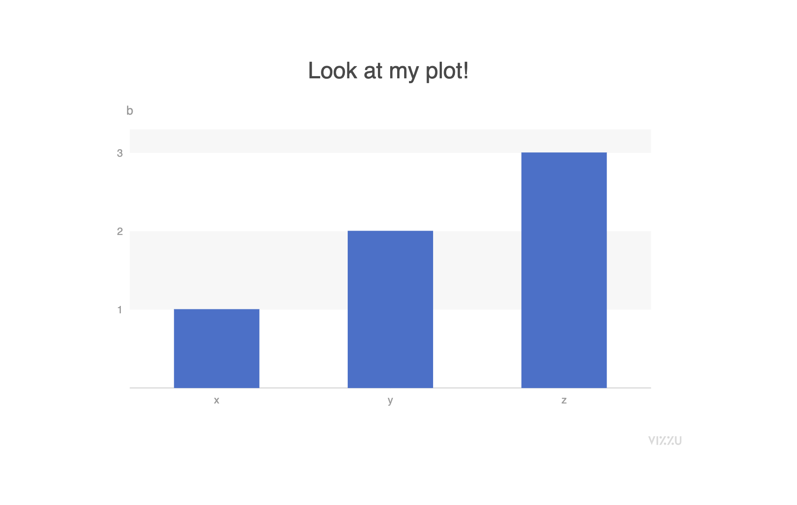
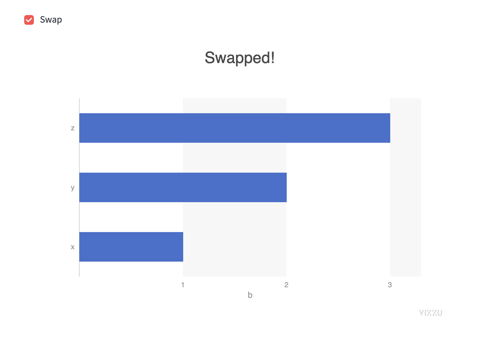

# Streamlit-Vizzu Tutorial

## Installation

To get started with Streamlit-Vizzu, first you need to install the package

```sh
pip install streamlit-vizzu
```

## Create your first chart

To create a streamlit-vizzu chart, you will need, at minimum, some data to
display, and some configuration to tell Vizzu how to display it.

Create a file called `streamlit_app.py` with the following content

```python
import pandas as pd
import streamlit as st
from ipyvizzu.animation import Config, Data

from streamlit_vizzu import VizzuChart

# Create a VizzuChart object with the default height and width
chart = VizzuChart()

# Generate some data and add it to the chart
df = pd.DataFrame({"a": ["x", "y", "z"], "b": [1, 2, 3]})
data = Data()
data.add_data_frame(df)
chart.animate(data)

# Add some configuration to tell Vizzu how to display the data
chart.animate(Config({"x": "a", "y": "b", "title": "Look at my plot!"}))

# Show the chart in the app!
chart.show()
```

Then do `streamlit run streamlit_app.py` and you should see a plot appear like this:



## Make the chart animated!

There a lots of ways to make static charts in Streamlit apps, but Vizzu Charts aren't
just static, it's easy to animate them to explore the data and display it in different
ways. You can add some code to make this into an interactive app by adding a streamlit
widget and another `chart.animate` call.

Here is a simple example which can be added to the script before `chart.show()`

```python
if st.checkbox("Swap"):
    chart.animate(Config({"y": "a", "x": "b", "title": "Swapped!"}))
```

You should now see a checkbox added to your app, and when you check the box the chart
will transition between the previous version and this new one



## Interact with the chart

One great feature of the VizzuChart component is that you can interact with elements
on the chart and use that data elsewhere in your streamlit app!

If you change the end of your streamlit app to get the return value from `chart.show()`,
you can write that data in your app.

A simple version of this is simply to write out all the data that is returned from
the latest click:

```python
data = chart.show()

st.write(data)
```

Now if you click on one of the bars of your chart, you should see something like
the following below the chart:

```json
{
  "position": {
    "x": 373,
    "y": 335
  },
  "coords": {
    "x": 0.534454,
    "y": 0.186174
  },
  "marker": {
    "categories": {
      "a": "y"
    },
    "values": {
      "b": 2
    },
    "id": 1
  }
}
```

If you want to just present information about the bar which was clicked, you can
do something like this:

```python
data = chart.show()

if data is not None and "marker" in data:
    st.write("Value of clicked bar:", data["marker"]["values"]["b"])
```

You should then see something like the following after you click on a bar:

    Value of clicked bar: 2

## (Advanced) Drill into your data with chart interactions

With the streamlit model of always running the script from the top to bottom, it takes
a little bit of extra work to allow clicking on a chart to update the chart itself, but
this can be accomplished by:

1. Add filters to the data that depend on the latest object clicked
2. Saving the latest click in the streamlit session state

To make a more interesting example, update the underlying data for your app

```python
df = pd.DataFrame(
    {
        "a": ["x", "y", "z", "x", "y", "z"],
        "b": [1, 2, 3, 4, 5, 6],
        "c": ["A", "A", "B", "B", "C", "D"],
    }
)
```

This gives you a third axis that you can use to look at your data, for a particular
value of "a" and "b".

You should pass `rerun_on_click=True` to VizzuChart to
force the streamlit app to rerun every time the chart is clicked.

Finally, you can also get the "a" value of the last chart click using the `get` method of the chart, using `.` to access nested values.
If you haven't yet clicked on the chart, or have clicked on something other
than a bar representing an "a" value, this will return None

```python
# This is equivalent to chart["marker"]["categories"]["a"], but won't raise an exception if the nested value isn't found.
bar_clicked = chart.get("marker.categories.a")
```

Finally, you can use the value of the last bar clicked to filter your chart
to show the different "b" and "c" values associated with that value of "a".

```python
if bar_clicked is None:
    chart.animate(Data.filter())
    chart.animate(
        Config({"x": "a", "y": "b", "title": "Look at my plot! Click!", "color": None}),
    )
else:
    chart.animate(Data.filter(f"record['a'] == '{bar_clicked}'"))
    chart.animate(
        Config(
            {
                "x": "c",
                "y": "b",
                "title": f"Drilldown for a = {bar_clicked}",
                "color": "c",
            }
        )
    )
```

Here is the complete script:

```python
import pandas as pd
from ipyvizzu.animation import Config, Data

from streamlit_vizzu import VizzuChart

chart = VizzuChart(rerun_on_click=True)

df = pd.DataFrame(
    {
        "a": ["x", "y", "z", "x", "y", "z"],
        "b": [1, 2, 3, 4, 5, 6],
        "c": ["A", "A", "B", "B", "C", "D"],
    }
)

data = Data()
data.add_data_frame(df)
chart.animate(data)

bar_clicked = chart.get("marker.categories.a")

if bar_clicked is None:
    chart.animate(Data.filter())
    chart.animate(
        Config({"x": "a", "y": "b", "title": "Look at my plot! Click!", "color": None}),
    )
else:
    chart.animate(Data.filter(f"record['a'] == '{bar_clicked}'"))
    chart.animate(
        Config(
            {
                "x": "c",
                "y": "b",
                "title": f"Drilldown for a = {bar_clicked}",
                "color": "c",
            }
        )
    )

chart.show()
```

If you then click on the `z` bar, you will see the chart transition to show
the breakdown of values of `c` that are associated with rows where `a` == `z`


If you click anywhere else on the chart, it will go back to the previous chart

## Next steps

For more inspiration for what streamlit apps you can build around your Vizzu charts,
you can look in the `example_apps/` folder, and also can see the
[ipyvizzu docs](https://ipyvizzu.vizzuhq.com/) (since this streamlit component behaves
similarly to )
